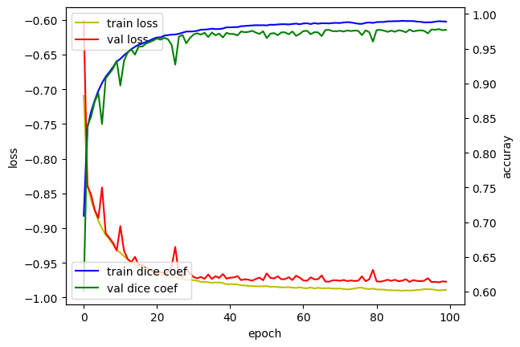
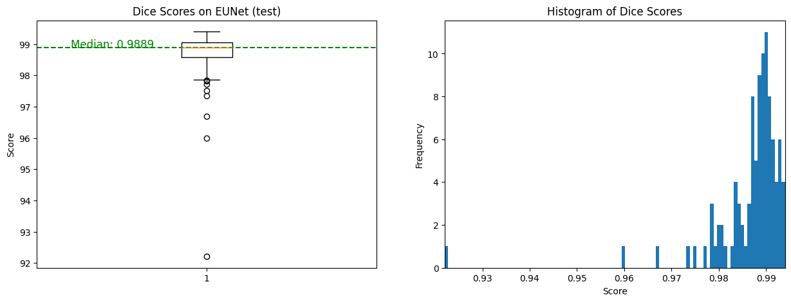

The growth and development of the fetal head and brain during pregnancy are crucial for the child's long-term health and well-being. However, fetal ultrasound images are prone to variations due to patient-specific factors and image issues such as signal dropouts, artifacts, and missing boundaries. Hence, there is a need for automatic methods to ensure accurate and consistent measurements of fetal head and brain growth

Application 

<gradio-app src="https://aaylmao-hc-prediction.hf.space"></gradio-app>
<!--

EfficientNet-Unet is a neural network architecture designed for semantic segmentation tasks, which combines the EfficientNet architecture for feature extraction with the UNet architecture for segmentation. In this architecture, the encoder part of the EfficientNet is replaced by the contracting path of the UNet, which consists of a series of convolutional and max pooling layers to downsample the input image and capture its features. The expansive path of the UNet is then used to upsample the feature map and generate pixel-level segmentation masks.

The EfficientNet-Unet architecture leverages the efficient feature extraction capabilities of the EfficientNet, which allows it to achieve state-of-the-art performance on image classification tasks, and combines it with the powerful segmentation capabilities of the UNet, which allows it to generate accurate segmentation masks with fewer parameters and faster inference times.

Below graph summarizes the training of EfficientNet Unet over 100 epochs.  

  

Predictions on the test set were made and their dice scores were calculated. Their distribution is represented below with a histogram and a boxplot.

  

Median dice score of 0.9889 was obtained the test dataset (10% of total [dataset](https://zenodo.org/record/1322001))
-->

Hyperparameter tuning performed using KerasTuner

<iframe src="https://drive.google.com/file/d/179ToblRzB8v83hxiPjTHCypfmyXziKQT/preview" width="640" height="480" allow="autoplay"></iframe>
